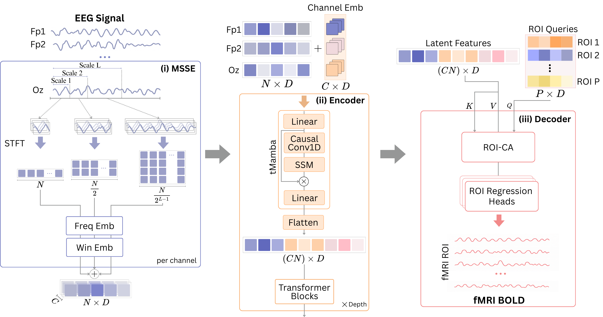

# 🧠 MARBLE [MICCAI 2026]

Official PyTorch implementation of our MICCAI 2026 paper: **MARBLE**: Lightweight EEG-to-fMRI Translation via Mamba-Attention and ROI-Conditioned Decoding.
The study addresses the challenging task of EEG-to-fMRI synthesis by introducing a novel Mamba-Attention architecture and an ROI-conditioned cross-attention mechanism for efficient and interpretable multimodal brain signal translation. 
The proposed framework achieves strong reconstruction performance while substantially improving computational efficiency, reducing the number of model parameters by 3.2× and peak memory consumption by 2.3× compared with existing approaches.

## 📘 Overview

---

## 📂 Repository Structure
```
marble/
├── models/            
│   ├── marble.py           # Model
├── main.py                 # Main training script
├── engine.py               # Training engine
├── optim.py                # Optimizer 
├── utils.py                # Utilities (e.g., metric logging)
├── requirements.txt        # Python dependencies
├── README.md               # This file
```
### Installation

1. **Clone the repository**
```bash
   git clone https://github.com/emeelkaa/marble.git
   cd marble
```

2. **Create a virtual environment (recommended)**
```bash
   python -m venv venv
   source venv/bin/activate  # On Windows: venv\Scripts\activate
```

3. **Install dependencies**
```bash
   pip install -r requirements.txt
```
> **📌 Note:** For Mamba installation, please refer to the official repository:
> [https://github.com/state-spaces/mamba](https://github.com/state-spaces/mamba)

## 🚀 Quick Start

1. **Download the datasets**
   - https://huggingface.co/ssssssup/NeuroBOLT(https://physionet.org/content/chbmit/1.0.0/)
  
2. Please refer to the Neurobolt authors for preprocessing. Run it 
https://github.com/soupeeli/NeuroBOLT
